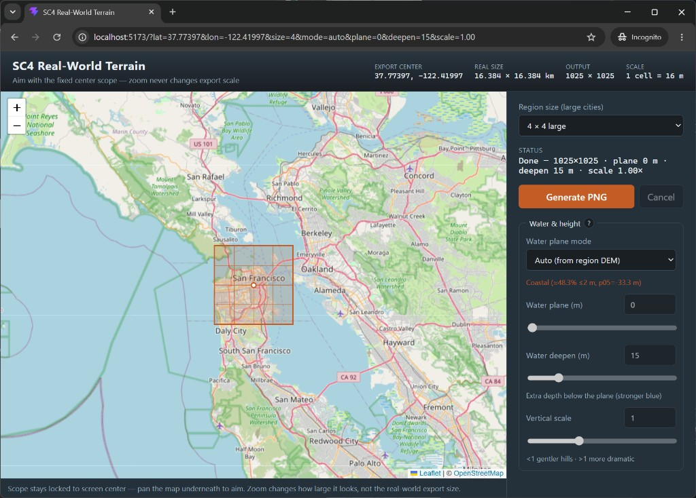

# SC4RWT — Real-World Terrain for SimCity 4

Browser app that turns a real-world map selection into a **16-bit grayscale heightmap PNG** for SimCity 4 regions.



_San Francisco Bay — 4×4 large cities, auto coastal leveling, shareable URL params._

## How to use

### 1. Aim with the map

The orange square in the middle of the map is your **export region**. It stays fixed on screen — **pan the map underneath** to choose where in the real world to export.

- **Zoom** only changes how large the square looks. It does **not** change the real-world size of the export.
- Use the **Map** dropdown (top-right of the map) to switch between Standard, Dark, Light, Topo, or Satellite tiles if that helps you aim.

### 2. Pick a region size

Under **Region size (large cities)**, choose how big the SimCity 4 region should be:

| Size    | What it means           | Rough real-world span | Output PNG  |
| ------- | ----------------------- | --------------------- | ----------- |
| **1×1** | One large city          | ~4.1 × 4.1 km         | 257 × 257   |
| **2×2** | Four large cities       | ~8.2 × 8.2 km         | 513 × 513   |
| **4×4** | Sixteen large cities    | ~16.4 × 16.4 km       | 1025 × 1025 |
| **8×8** | Sixty-four large cities | ~32.8 × 32.8 km       | 2049 × 2049 |

Scale is always **1 terrain cell = 16 meters**. Bigger sizes take longer to generate and download a larger PNG.

### 3. Water & height

These settings control how real elevation becomes SC4 terrain (what shows as water vs land, and how steep hills look).

#### Auto mode (recommended to start)

Set **Water plane mode** to **Auto (from region DEM)**.

When you click **Generate PNG**, the app samples elevations under the orange square and picks sensible values for you:

- **Coast / ocean** → water plane near **0 m** sea level
- **Inland rivers / lakes** → water plane near the low elevation band in that area
- **Vertical scale** may bump up a bit in flatter areas so relief still reads in-game

You’ll see a short reason under the controls after generate (or after Calculate in Manual).

**Note:** Auto is still a **work in progress** — it often helps, but it does **not always** pick a perfect water plane or scale for every region. If the shore looks wrong or hills are too flat/steep, switch to **Manual**, use **Calculate from DEM** as a starting point, then tweak the sliders.

#### Manual mode

Set **Water plane mode** to **Manual** when you want full control:

| Control              | What it does                                                                                   |
| -------------------- | ---------------------------------------------------------------------------------------------- |
| **Water plane (m)**  | Real-world elevation treated as SC4 sea level. Land above this stays dry; below becomes water. |
| **Water deepen (m)** | Extra depth pushed below the plane so water looks deeper / more blue in SC4.                   |
| **Vertical scale**   | Stretches or flattens hills. **&lt; 1** = gentler; **&gt; 1** = more dramatic.                 |

Helpful buttons in Manual:

- **Calculate from DEM** — samples the current map region and fills the three sliders (same idea as Auto, but you can tweak afterward).
- **Reset to defaults** — coastal starter: plane **0 m**, deepen **15 m**, scale **1×**.

### 4. Generate

Click **Generate PNG**. A spinner on the button means it’s working; the heightmap downloads when ready.

- Use **Cancel** if you need to stop.
- Your current map center, size, and water settings are kept in the **URL**, so you can bookmark or share the exact setup.

### Tip

Try **Auto** first for a quick generate. If the shore or hills look off, switch to **Manual**, click **Calculate from DEM** for a starting guess, then nudge plane / deepen / scale. You can also skip Auto entirely and stay in Manual the whole time.

## Features

- **Fixed real-world scale** — 1 SC4 terrain cell = **16 m**; map zoom only changes how the scope looks, not export size.
- **Center scope** — orange region overlay stays on screen; pan the map to aim what gets exported.
- **Region sizes** — 1×1, 2×2, 4×4, or 8×8 large cities (`N × 256 + 1` pixels per side).
- **Auto water & height** — reads elevation under the scope; coastal areas use 0 m AMSL, inland rivers use a low elevation band + optional vertical scale boost.
- **Manual overrides** — water plane, deepen, and vertical scale sliders; **Calculate from DEM** fills manual values from the current region.
- **Shareable setup** — `lat`, `lon`, `size`, `mode`, `plane`, `deepen`, and `scale` live in the URL query string.
- **Client-only** — terrain fetch, resample, encode, and PNG download run in the browser (Web Worker for generation).

## Run locally

```bash
npm install
npm run dev
```

Open the URL Vite prints (usually `http://localhost:5173/`).

Optional:

```bash
npm test          # unit tests
npm run build     # production bundle → dist/
npm run preview   # serve dist/
```

## Implementation

### Terrain

AWS Mapzen **Terrarium** tiles:

`https://s3.amazonaws.com/elevation-tiles-prod/terrarium/{z}/{x}/{y}.png`

Decode: `height = r * 256 + g + b / 256 - 32768` (meters AMSL)

The export region is resampled to an exact **16 m** grid in a local UTM projection, then encoded to SC4 height values.

### Height encoding

```text
relative = (realElevationMeters - waterPlane) * verticalScale
if relative <= 0: relative -= waterDeepen
sc4HeightMeters = relative + 250
value16 = clamp(round(sc4HeightMeters * 10), 0, 65535)
```

With default water plane, real **0 m → value 2500** (SC4 sea level).

### PNG output

True **16-bit grayscale PNG** (custom encoder + zlib level 0): one sample per SC4 terrain cell, row order north-up in the file.

### URL parameters

| Param                      | Meaning                            |
| -------------------------- | ---------------------------------- |
| `lat`, `lon`               | Export center                      |
| `size`                     | Large cities per side (1, 2, 4, 8) |
| `mode`                     | `auto` or `manual`                 |
| `plane`, `deepen`, `scale` | Manual water / height settings     |
